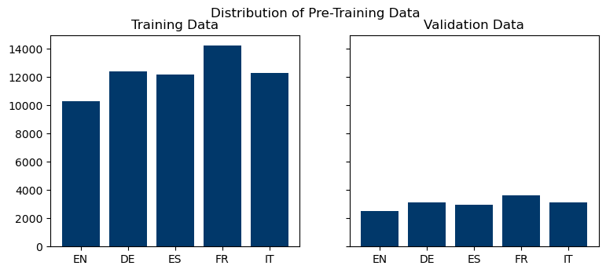
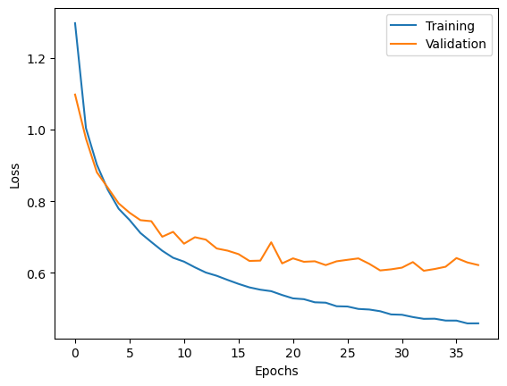
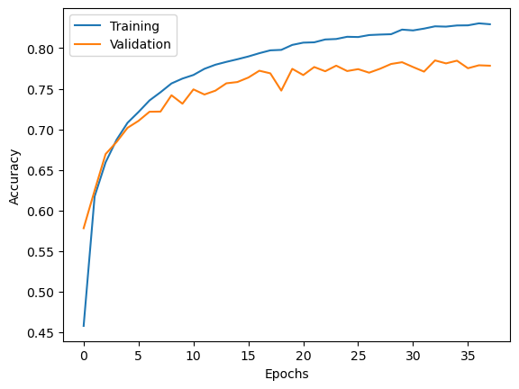
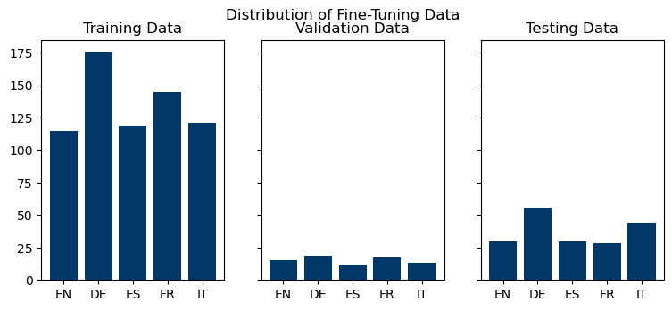

# Language Detection on the Edge

## Introduction

AI on the edge, which refers to running artificial intelligence algorithms directly on devices such as smartphones, cameras, and sensors, has become increasingly significant in recent years. This approach to AI processing can improve efficiency, reduce latency, and enhance privacy by processing data locally rather than sending it to a remote server. One important application of AI is the ability to identify spoken languages. This technology can benefit various industries such as customer service, law enforcement, and healthcare by providing real-time language translation services, improving communication, and reducing errors. Overall, AI on the edge and language identification have the potential to improve productivity, enhance user experience, and facilitate global communication. By combining these two fields of research, we found that new question arise, such as:
- How can we design a neural network, that classifies languages for use on the edge?
- How does the neural network perform on the edge compared to on a computer with
full computing power?
- How much storage does the neural network require on the edge?

In this project, we develop a neural network (NN), that is able to classify spoken language. To this end, we pre-train our model on the FLEURS data set and then fine-tune it on our own generated data set. This is done, to increase the sensitivity of our network to noise and device specific patterns of the used microphone. Subsequently, we convert the trained model to a format, which enables the NN to run on the edge, on an STM32, equipped with a microphone. To this end, we use the MicroAI framework, which uses quantization to convert our model from a Tensorflow model to a model in C. This documentation explains how we approach solving this problem.

This documentation is structures as follows:
- Building the Neural Network
    - Pre-Training
    - Fine-Tuning
- Deployment on the Edge

## Building the Neural Network
We train our model in two stages, more specifically a pre-training phase to teach it the fundamental patterns of languages based on the FLEURS dataset and a fine-tuning phase, where we collect data with the microphone that is used on the edge. This data is more noisy compared to the pre-training data.

The languages that we aim to classify are:
1. English
2. German
3. Spanish
4. French
5. Italian

### Pre-Training
We pre-train our model on the FLEURS dataset. We drop every language that we do not intend to classify. The data is processed where each sample consists of 1 second of data with a sampling rate of 16.000 Hz. Thus, one minute speech data would be transformed into 60 samples, containing 16.000 values each. The distribution of pur data w.r.t. the different languages are as follows:

We trained for 50 epochs, however the early callback, which stops training after lack of improvement, halted the training after 38 epochs (x-axis). In the left image we see the accuracy plotted over time, here we see the common behaviour in machine learning. At some point (around 25 epochs in our case) the validation line stagnates and the training line keeps increasing. From this moment onwards we stop the training and capture the weights as our final model. The following two images show the training loss and accuracy.

Finally, when feeding the self-collected data to this model, it achieves an accuracy of 20% which is equal to complete randomness.

### Fine-Tuning
The data that will be used for fine-tuning has been collected by ourselves, using the board and attached microphone. Here, as mentioned before, we selected the 5 languages for which we could collect at least one female and male voice. In total we collected 10 minutes of data. Roughly 1 minute per person and one male and female person per language. The self-collected data consists of recordings of very language, where half is spoken by a female subject and half by a male subject. After permutation, the splitted training, validation and testing sets are described as follows:

Some imbalance can be seen in the data, due to the random permutations and due to the imbalance in sample length. However, this should not greatly impact the performance, because none of the samples is heavily over or under-represented.

### Comparison of pre-trained model and fine-tuned model
The only pre-trained model achives a 20% accuarcy, which represents almost absolut randomnes since we are classifying 5 languages.

## Deployment on the Edge